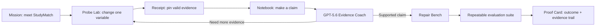

# Glassbox — Product Requirements Document

**Product:** Glassbox — The AI Detective Lab  
**Hackathon track:** Education  
**Version:** Hackathon MVP v1  
**Status:** Build-ready  
**Last aligned with Build Week information:** 21 July 2026

## 1. Product in one sentence

Glassbox is a playable AI-literacy lab where a learner proves that an opaque recommendation model is unfair by running controlled experiments, writing an evidence-backed hypothesis, repairing the model, and verifying the repair with an auditable before/after test.

## 2. Why this should exist

Students are quickly becoming fluent at *using* AI but rarely learn how to test whether an AI system is reliable, fair, or making decisions for the right reason. Most AI education products teach prompting or give answers. They do not let learners practice the scientific habits needed to interrogate a model: isolating variables, collecting evidence, forming a falsifiable claim, and testing a repair.

Glassbox turns that abstract literacy goal into one memorable action: **catch a hidden rule in an AI system before it harms someone.**

The first case is intentionally concrete. A fictional study-group recommender, `StudyMatch v0.7`, treats two otherwise equivalent students differently because it contains a hidden commute-zone proxy. The learner must discover it; Glassbox must not give the answer away.

## 3. Hackathon thesis and track decision

Submit to the **Education** track. This is not a chatbot, an answer generator, or a plagiarism detector. It is an AI-native learning experience for students and a reusable assessment primitive for educators: evidence that a learner can reason about an AI system rather than merely operate one.

Glassbox is designed for the four equal Build Week judging dimensions:

| Criterion | What Glassbox demonstrates |
| --- | --- |
| Technological Implementation | A real, runnable full-stack app. GPT-5.6 returns schema-validated teaching judgments; the app maintains a deterministic evidence ledger and evaluates a changed model across a repeatable test suite. |
| Design | A coherent game-like experience from case briefing through proof, with visible state, error/fallback states, mobile usability, and no login barrier for judges. |
| Potential Impact | It teaches the core civic/workplace skill students need in an AI-shaped world: how to challenge a model with evidence. |
| Quality of the Idea | The interaction model is **model literacy as a repair game**, not “chat with a tutor.” The output is a learner-owned proof trail. |

## 4. Target users

### Primary learner

Students aged 13–18 who use AI but have not been taught to evaluate its decisions. They should be able to finish Case 01 alone in 8–12 minutes.

### Secondary user

Teachers, librarians, and youth-program facilitators who need an engaging 20–30 minute AI-literacy activity with a visible learning artifact rather than an unobservable chat transcript.

### Judge path

A judge with no account and no API key must be able to complete a polished demo case in under three minutes using deterministic demo mode.

## 5. Product principles

1. **Evidence before answers.** Glassbox coaches the learner but does not reveal the hidden rule before their evidence supports it.
2. **The system is inspectable.** A score, claim, and repair must trace back to data and a reproducible calculation.
3. **AI judges reasoning, not vibes.** GPT-5.6 evaluates a learner’s claim against the actual receipts; it never fabricates experiment results.
4. **A model is repairable.** The finish is not “AI is bad.” The learner removes a harmful proxy and proves the replacement behaves better.
5. **Demo magic must survive failure.** The core case works deterministically without an API key; AI features enhance coaching and reasoning feedback when the key is configured.

## 6. MVP scope

### In scope — Case 01: The StudyMatch Mystery

1. **Briefing.** The learner meets a fictional model that recommends study-group matches.
2. **Probe Lab.** The learner compares a fixed reference profile with a configurable second profile, makes a controlled or confounded test, and sees both results and a test receipt.
3. **Evidence Notebook.** The learner pins receipts and submits a natural-language hypothesis about the suspected hidden rule.
4. **AI Evidence Coach.** GPT-5.6 returns a structured evaluation of whether the hypothesis is supported by the selected evidence and suggests one next test without exposing the solution prematurely.
5. **Repair Bench.** The learner removes the harmful commute-zone proxy, selects learning-relevant replacements, and re-runs a deterministic evaluation suite.
6. **Proof Card.** Glassbox shows computed before/after fairness and match-quality measures, the learner’s evidence chain, and an exportable/shareable completion card.
7. **Educator peek.** A compact, local-only panel explains what the learner demonstrated: controlled testing, evidence quality, hypothesis quality, and repair verification.

### Explicitly out of scope for the hackathon MVP

- Accounts, payments, school integrations, grades, or real student records.
- Real-world admissions, employment, medical, lending, or school-placement decisions.
- A general-purpose “upload any model and audit it” product.
- Multi-case authoring, collaboration, long-term analytics, and teacher administration.
- Claims that Glassbox certifies fairness in a real production ML system.

## 7. Core user experience



### 7.1 Mission

- Set the story stakes: “A study-group matcher may be treating equivalent students differently.”
- State three visible objectives: run a controlled test, name the hidden rule with evidence, repair and verify.
- Offer `Start Case 01` and a one-click `Judge demo` path preloaded with three high-signal tests.

### 7.2 Probe Lab

The learner starts with a reference profile and edits or swaps the comparison profile across six variables:

- topic interest
- availability
- skill level
- collaboration preference
- commute zone
- accessibility setting

For every run, the UI must show:

- a clearly labeled model output (match score and recommendation);
- which variables differ;
- whether the test is controlled (`exactly one variable changed`) or confounded;
- a timestamped, immutable receipt ID;
- a plain-language explanation of what the test can and cannot prove;
- a `Pin as evidence` action.

The hidden pre-repair rule is deterministic and versioned in code: an otherwise irrelevant Zone C value lowers the score by 44 points. Do not expose this constant or the source code in the learner UI before repair.

### 7.3 Evidence Notebook

- Show pinned receipts in chronological order with changed field, score delta, validity, and annotation.
- Require at least two controlled receipts involving the relevant variable before a hypothesis can be marked strongly supported.
- Let the learner write a 1–280 character hypothesis in their own words.
- Display a claim-evidence map, not an opaque “correct/incorrect” grade.
- Preserve every submitted hypothesis in local state for the session.

### 7.4 GPT-5.6 Evidence Coach

This is the OpenAI-native core. It is a constrained reasoning evaluator, not a chat widget.

**Input supplied by the server**

- selected receipts from the local evidence ledger;
- the learner’s hypothesis;
- permitted case facts and rubric;
- whether enough controlled evidence exists;
- the hidden rule only as an evaluation reference, never as text to reveal prematurely.

**Response schema**

```ts
type EvidenceCoachResult = {
  verdict: "supported" | "inconclusive" | "contradicted";
  evidenceAssessment: Array<{
    receiptId: string;
    relevance: "strong" | "weak" | "confounded";
    explanation: string;
  }>;
  claimStrength: 0 | 1 | 2 | 3 | 4;
  feedback: string;
  nextBestExperiment: {
    changeOnly: string;
    rationale: string;
  } | null;
  revealRepairAccess: boolean;
};
```

**Non-negotiable guardrails**

- Use GPT-5.6 Structured Outputs with Zod parsing through a server-only OpenAI client.
- Model feedback may refer only to provided receipts and case facts; it must say “I do not have enough evidence” instead of inventing a result.
- Before evidence threshold is met, feedback may recommend a variable to isolate but must not name the hidden proxy or its penalty.
- A refusal, timeout, invalid output, missing key, or network error must show a friendly fallback and keep deterministic case progress available.
- Log no student identifiers, prompts, or raw receipts remotely beyond the immediate request.

### 7.5 Repair Bench

- Show versioned factor cards for `StudyMatch v0.7`.
- The learner removes `Zone C penalty` only after a supported hypothesis or by opening judge demo mode.
- The UI lets them add learning-relevant factors such as stated topic alignment and requested collaboration style.
- Create `StudyMatch v0.8` as a new immutable model configuration. The post-repair scorer must actually use the new configuration.
- Run an eight-pair evaluation suite in the browser/server, not fixed numbers. Calculate and display:
  - equivalent-treatment fairness rate;
  - average match-quality score;
  - number of pairs affected by the removed proxy;
  - exact before/after delta.

### 7.6 Proof Card

- Show the learner’s selected evidence, hypothesis verdict, factor removal, and computed before/after outcomes.
- Generate a downloadable PNG or printable card, not a non-working share button.
- Use precise wording: `Case 01 completed — simulated model repair`, never “certified fair.”
- Include `Replay Case` and `Reset local session` actions.

### 7.7 Educator peek

For MVP, this is a local no-login summary on the completion screen:

- number of controlled vs. confounded tests;
- whether the learner formed an evidence-supported hypothesis;
- repair run completed;
- suggested facilitation question.

It is not a dashboard or learner surveillance system.

## 8. Technical architecture

### Front end

- Existing TanStack Start + React + TypeScript + Tailwind codebase.
- Preserve the paper-notebook visual language: cream canvas, graph-paper texture, strong ink outlines, coral CTA, doodles, receipts, Pip helper, and reduced-motion support.
- Zustand remains the session-state store; persist **only** anonymous game progress locally.

### Domain engine — source of truth

Place a pure TypeScript case engine under `src/features/case-engine/`.

- `case-config.ts`: versioned factor definitions, profiles, scoring configuration, evaluation-pair fixtures.
- `scorer.ts`: deterministic pre-repair and post-repair scores.
- `experiment.ts`: changed-field calculation, controlled-test classification, receipt creation.
- `evaluation.ts`: repeatable fairness/match-quality measurements.
- `rubric.ts`: deterministic evidence threshold and repair-access decision.

The client must never ask an LLM to calculate scores, choose test validity, or generate fairness metrics. Those are derived from the engine and are unit-tested.

### GPT-5.6 service

- Add the official `openai` JavaScript SDK.
- Add one server route/function, e.g. `POST /api/evidence-coach`.
- Read `OPENAI_API_KEY` on the server only. Never prefix it with `VITE_`; never send it to the browser or commit it.
- Use `OPENAI_MODEL` with default `gpt-5.6`.
- Use `responses.parse` and a Zod Structured Output schema for `EvidenceCoachResult`.
- Validate the response again at the boundary; return a typed application error on refusal or failure.
- Add an explicit demo fallback response derived from the deterministic rubric when `OPENAI_API_KEY` is absent. Mark this in dev tools/README only; do not disguise it as a live API call.

### Data and privacy

- Use fictional student profiles only.
- No auth, database, analytics SDK, tracking pixel, or student PII for MVP.
- All game state is local; API calls contain only anonymous case receipts and the learner’s claim.
- Include a visible `No real student data` message and a compact privacy note.

## 9. Non-functional requirements

- Works on current Chrome, Edge, Safari, and Firefox desktop/mobile sizes.
- No-login judge flow; demo mode must work offline after bundle load except for optional AI coaching.
- Each interaction responds quickly: local test under 100 ms; coach shows a loading state and returns a fallback within a bounded timeout.
- Keyboard-operable controls, visible focus, semantic form labels, readable contrast, and reduced-motion behavior.
- Friendly states for empty notebook, lack of evidence, API failure, invalid hypothesis, and completed case.
- `npm run build` must pass. Add focused unit tests for the scoring, experiment validity, evidence threshold, evaluation metrics, and fallback coach mapper.

## 10. Success criteria

### Product success

A first-time learner can complete the loop without instruction:

1. create or load controlled tests;
2. identify the relevant variable from evidence;
3. state a defensible claim;
4. repair the simulated model;
5. understand the metric change and why it occurred.

### Demo success

Within 30 seconds, a viewer sees two otherwise equivalent learner profiles receive dramatically different recommendations after one changed variable. Within 90 seconds, they see the learner’s evidence-backed repair make equivalent profiles receive equivalent treatment.

### Engineering success

- The app runs locally with no API key in demo mode.
- With a valid key, GPT-5.6 produces a schema-validated evidence assessment.
- Every visible metric comes from a deterministic calculation, not a static UI value.
- No client source, built asset, repository file, or UI string contains legacy-platform branding.

## 11. Acceptance criteria

| Area | Acceptance test |
| --- | --- |
| Controlled experiment | Changing only `commute zone` creates a controlled receipt and shows a 44-point pre-repair difference. Changing two fields is visibly confounded and cannot independently unlock repair. |
| Evidence | Pinned receipts retain exact input profiles, score outputs, differing fields, validity, and model version through refresh. |
| AI coach | A supported claim receives claim-specific feedback referencing receipt IDs. An unsupported claim receives a next experiment, not an invented diagnosis. |
| Repair | Removing the proxy changes the actual scorer. The evaluated eight-pair suite reports computed, reproducible metrics. |
| Fallback | Deleting/omitting `OPENAI_API_KEY` does not break Case 01; it presents a transparent local coaching fallback. |
| UX | A judge can use `Judge demo` to see the full payoff without an account. Loading, error, and empty states are intentional and styled. |
| Quality | Production build passes; focused tests pass; README includes setup, demo data, project architecture, and an accurate Codex + GPT-5.6 decision log. |

## 12. Demo plan — 2 minutes 40 seconds

1. **0:00–0:15 — Hook.** “Students are learning to use AI. Glassbox teaches them how to challenge it.” Show Maya and an equivalent profile; only commute zone changes; score collapses by 44 points.
2. **0:15–0:55 — Investigation.** Pin the receipt, run/inspect a confirming test, and show the Notebook claim. The AI Evidence Coach maps the learner’s claim to actual receipts rather than supplying an answer.
3. **0:55–1:40 — Repair.** Remove the harmful proxy, add relevant learning signals, and run the eight-pair evaluation suite. Show the real before/after fairness shift.
4. **1:40–2:10 — Proof.** Open the learner’s proof card: experiments, claim, repair, and measured outcome. Show the local educator peek.
5. **2:10–2:35 — Technical proof.** Briefly show the deterministic case engine, the server-only GPT-5.6 Structured Output route, and a unit test. Explain that the model can coach reasoning but cannot alter results.
6. **2:35–2:40 — Close.** “Don’t just use AI. Learn to test it.”

Use a public or unlisted YouTube video under three minutes, with a clear voiceover that explicitly explains both how Codex and GPT-5.6 were used.

## 13. Build Week submission checklist

This list reflects the official Devpost page and announcements checked on 21 July 2026. Re-check the live rules immediately before submitting.

- [ ] Choose **Education** as the best-fit category.
- [ ] Build a working, non-trivial project using Codex and GPT-5.6; document the core Codex session and retrieve its `/feedback` session ID.
- [ ] Deploy a no-login judge URL, or provide unambiguous local test instructions and sample data.
- [ ] Add a public source repository with an appropriate open-source license, or share a private repo with `testing@devpost.com` and `build-week-event@openai.com`.
- [ ] Include a truthful README: setup, run steps, sample/demo path, architecture, key decisions, and how Codex/GPT-5.6 were used.
- [ ] Write the Devpost description in the team’s own voice; do not submit unedited model prose or claim unfinished features.
- [ ] Upload a public/unlisted YouTube video under three minutes with spoken coverage of the product, Codex use, and GPT-5.6 use. Test it while logged out.
- [ ] Verify teammate invitations are accepted and the Devpost entry state says `Submitted`, not `Draft`.
- [ ] If this is an extension of pre-existing work, record exactly what was newly built with Codex/GPT-5.6 after the eligible start date; retain dated commits and session evidence.
- [ ] Verify all third-party assets, fonts, libraries, music, images, and data have licenses/permission appropriate for use.

## 14. Implementation sequence

### Phase 1 — make the existing demo truthful

1. Map current routes and store; preserve the visual system.
2. Extract all scoring, receipts, evidence validation, and repair calculations into the pure deterministic engine.
3. Replace fixed repair metrics with the evaluation suite.
4. Add focused tests and a judge-demo seed/reset action.

### Phase 2 — add the OpenAI-native reasoning layer

1. Add server-only API configuration and `.env.example`.
2. Implement and test the typed Evidence Coach endpoint using GPT-5.6 and Zod Structured Outputs.
3. Wire the Notebook to real structured feedback with loading, refusal, timeout, and deterministic fallback states.
4. Make the UI explain which statements are engine facts and which are coaching feedback.

### Phase 3 — finish the presentation and submission surface

1. Implement a real proof-card export.
2. Complete educator peek and accessibility states.
3. Update README, `DECISIONS.md`, demo script, and submission copy with evidence of the build process.
4. Run build/tests, deploy, record the demo, and complete Devpost fields.

## 15. Risks and mitigations

| Risk | Mitigation |
| --- | --- |
| API unavailable, credits unavailable, or rate-limited during judging | Deterministic demo mode remains complete and visibly functional without an API key. Record the demo using a successful API session before submission. |
| GPT-5.6 reveals the answer too early or makes an unsupported claim | Strict schema, deterministic preconditions, limited case facts, rubric-based gating, and server-side prompt tests. |
| “Fairness” claims sound too broad | Always label the case as a simulated educational model and display the exact tested metric. Never imply real-world certification. |
| The project looks like static mock UI | Replace every pivotal static result—receipts, hypothesis evaluation, repair outcome, proof export—with stateful logic and tests. |
| Judges cannot test an API-backed feature | Deploy a no-login demo fallback and include exact setup/judge instructions in the README. |

## 16. Future vision, explicitly after MVP

Glassbox can become a case-authoring platform for teachers: models of recommendation, content moderation, hiring, and medical triage are represented as safe, fictional “decision machines.” Students submit an evidence graph and a repair proposal, while educators review demonstrated reasoning—not a chat transcript or a multiple-choice score. The hackathon MVP proves this interaction model with one exceptional case.
