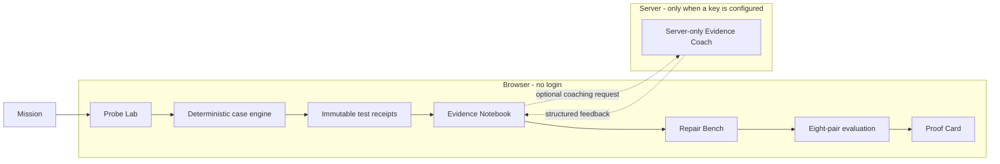

# Glassbox - The AI Detective Lab

> Students learn to test an AI decision system with evidence, repair a harmful rule, and prove the result.

Glassbox is a no-login AI-literacy experience for ages 13-18, built for the OpenAI Build Week Education track. In **Case 01: The StudyMatch Mystery**, a learner investigates a fictional study-group recommender, gathers controlled-test evidence, writes a hypothesis, repairs the simulated model, and verifies the result with a repeatable evaluation.

**This is a fictional educational simulation.** It uses no real student data and is not a fairness-certification tool.

**Live judge demo:** [glassbox-nu.vercel.app](https://glassbox-nu.vercel.app/)
**Source repository:** [NikhilRaikwar/Glassbox](https://github.com/NikhilRaikwar/Glassbox)
**Video demo:** [Watch on YouTube](https://youtu.be/rt21ZOx3N08)

## The learning loop

**Test -> collect evidence -> make a claim -> repair -> verify -> proof**

Glassbox is intentionally not a generic chatbot. It lets students practice a compact scientific method for AI systems: change one variable, inspect the result, save a receipt, explain the evidence, and test whether a repair actually changed the outcome.

## What makes the project judgeable

- **No-login demo:** A one-click Judge demo works with no account or API key.
- **Real model logic:** Scores, controlled-test checks, repair access, and fairness measurements come from a tested, pure TypeScript engine - never an LLM or static UI values.
- **Meaningful AI use:** GPT-5.6 acts as a constrained Evidence Coach that assesses only the learner's selected receipts; it cannot alter scores or decide a model is fair.
- **Proof, not a promise:** The completed case produces a computed evidence trail, before/after evaluation, educator peek, and a downloadable or printable proof card labelled **simulated model repair**.
- **Resilient demo:** A transparent deterministic fallback preserves the full learning loop if no API key is configured or the live coach is unavailable.

## Build Week submission evidence

| Devpost requirement | Glassbox evidence |
| --- | --- |
| Working project | The no-login [live judge demo](https://glassbox-nu.vercel.app/) starts directly in the product. |
| Best-fit category | **Education** - Glassbox helps students investigate and repair a fictional AI decision system. |
| Source and licensing | The linked repository includes a runnable project, sample case data, setup instructions, and an MIT license. Ensure the repository is public before submitting, or share private access with the addresses listed in the Devpost form. |
| Codex implementation | The **Built with Codex + GPT-5.6** section below records how Codex accelerated the implementation and where the key design decisions live. |
| GPT-5.6 use | The server-only Evidence Coach uses the Responses API and Zod Structured Outputs to assess supplied receipts; deterministic TypeScript remains the source of truth for results. |
| Video demo | [Public YouTube demo](https://youtu.be/rt21ZOx3N08) with a voiceover covering the working product, Codex, and GPT-5.6. |
| Still required before submit | Enter the primary build chat's `/feedback` Session ID in Devpost. |

## Judge demo path

1. From the landing page, choose **Judge demo**.
2. In the Evidence Notebook, inspect the two seeded controlled receipts and the confounded comparison.
3. Open **Repair Bench**, remove the `Zone C penalty`, retain the learning-relevant factors, and run the eight-pair evaluation.
4. Open the Proof Card to inspect the evidence trail, local educator peek, and the downloadable or printable proof card.

The seeded data is anonymous and fictional. The reference learner is Maya; an otherwise matched fictional learner in Zone C receives a 44-point lower pre-repair score. In `StudyMatch v0.8`, the commute-zone factor is removed and selected learning-relevant factors affect scoring for real.

## Architecture



- `src/features/case-engine/` is the product source of truth. It deterministically scores both model versions, validates controlled experiments, creates immutable receipts, checks the evidence threshold, and calculates evaluation metrics.
- `src/features/evidence-coach/` contains the typed TanStack Start server function, Zod output contract, constrained GPT-5.6 prompt, and deterministic fallback mapper.
- `src/store/useGlassboxStore.ts` persists anonymous progress in browser local storage. It does not store API keys or student identities.

## Run locally

Prerequisite: Node.js 20 or later and npm.

```sh
git clone git@github.com:NikhilRaikwar/Glassbox-.git
cd Glassbox-
npm install
npm run dev
```

Open the local URL printed by Vite. No account, database, or API key is required to complete the Judge demo path.

### Optional live GPT-5.6 Evidence Coach

The app is fully usable without a key. To use the optional live coach locally:

```powershell
Copy-Item .env.example .env
```

Set the server-only `OPENAI_API_KEY` in `.env` and restart the dev server. `OPENAI_MODEL` defaults to `gpt-5.6`. Never use a `VITE_` prefix for the key, and never commit `.env`.

If the key is absent, a request fails, the model refuses, or the structured response cannot be validated, Glassbox clearly uses its deterministic local fallback. The fallback keeps the full learning loop available; it is not presented as a live AI response.

## Verify

```sh
npm run test
npm run build
```

The test suite covers v0.7/v0.8 scoring, controlled-versus-confounded experiments, the evidence threshold, the eight-pair evaluation, and fallback coach mapping.

## Privacy and safety

- Every profile is fictional; Glassbox has no login, database, analytics SDK, tracking pixel, or student PII.
- Browser progress is local and can be reset or replayed safely.
- Live coach requests contain only selected anonymous receipt fields and the learner's hypothesis.
- Every completion artifact says **simulated model repair**, never "certified fair."

## Built with Codex + GPT-5.6

Glassbox was implemented in the primary Codex build session for this repository. Codex was used to evolve the existing TanStack Start prototype into a stateful product, extract a deterministic case engine, wire the learning flow, add the test suite, and verify the production build.

The optional Evidence Coach is designed for GPT-5.6 using the official OpenAI JavaScript SDK, the Responses API, `responses.parse`, and Zod Structured Outputs. GPT-5.6 is deliberately constrained to assess supplied receipts and explain evidence; it never determines model behavior or metrics.

## Submission readiness

Before submitting, make the deployment URL and a public or unlisted, voice-over product video available in the Devpost entry. Keep the dated Git commits, this primary Codex session, and the `/feedback` Session ID as Build Week evidence. Re-check the live event rules and Devpost form before final submission.

## Decisions and license

The key product and technical decisions are recorded in [DECISIONS.md](DECISIONS.md). Glassbox is released under the [MIT License](LICENSE), Copyright 2026 Nikhil Raikwar.
